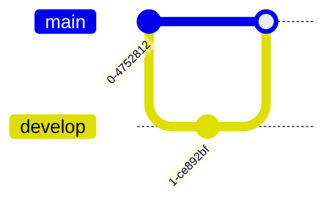

# m2svg

A Rust library and CLI for rendering Mermaid diagrams as ASCII art or SVG.

## Features

- **Parse** Mermaid diagram syntax (flowcharts, sequence diagrams, class diagrams, ER diagrams)
- **Render to ASCII** using Unicode box-drawing characters or plain ASCII
- **Render to SVG** with CSS variable theming
- **Zero runtime dependencies** for the core library

## Diagram Support

| Diagram Type | Supported |
|--------------|-----------|
| Flowchart | ✅ |
| Sequence Diagram | ✅ |
| Class Diagram | ✅ |
| State Diagram | ❌ |
| Entity Relationship Diagram | ✅ |
| GitGraph Diagram | ✅ |
| Mindmap | ❌ |
| User Journey | ❌ |
| Gantt | ❌ |
| Pie Chart | ❌ |
| Quadrant Chart | ❌ |
| Requirement Diagram | ❌ |
| C4 Diagram | ❌ |
| Timeline | ❌ |
| ZenUML | ❌ |
| Sankey | ❌ |
| XY Chart | ❌ |
| Block Diagram | ❌ |
| Packet | ❌ |
| Kanban | ❌ |
| Architecture | ❌ |
| Radar | ❌ |
| Treemap | ❌ |

## Installation

Add to your `Cargo.toml`:

```toml
[dependencies]
m2svg = "0.1"
```

## Usage

### Library

```rust
use m2svg::{render, render_to_svg};

// Render to ASCII (Unicode box-drawing)
let ascii = render("graph LR\n  A --> B", false).unwrap();
println!("{}", ascii);

// Render to ASCII (plain ASCII characters)
let ascii = render("graph LR\n  A --> B", true).unwrap();
println!("{}", ascii);

// Render to SVG
let svg = render_to_svg("graph LR\n  A --> B").unwrap();
println!("{}", svg);
```

### CLI

```bash
# Render to ASCII
echo "graph LR\n  A --> B" | m2svg

# Render to ASCII (plain ASCII mode)
echo "graph LR\n  A --> B" | m2svg --ascii

# Render to SVG
echo "graph LR\n  A --> B" | m2svg --svg
```

## Supported Diagram Types

### Flowcharts (graph/flowchart)


### Sequence Diagrams


### Class Diagrams


### ER Diagrams


### GitGraph Diagrams



#### GitGraph Configuration

GitGraph diagrams support Mermaid-compatible YAML frontmatter configuration:

```
---
config:
  gitGraph:
    showBranches: false
    showCommitLabel: false
    mainBranchName: trunk
    mainBranchOrder: 2
    rotateCommitLabel: true
---
gitGraph
   commit
   ...
```

**Structural options:**
| Option | Default | Description |
|--------|---------|-------------|
| `showBranches` | `true` | Show/hide branch name labels |
| `showCommitLabel` | `true` | Show/hide commit ID labels |
| `mainBranchName` | `main` | Custom name for the main branch |
| `mainBranchOrder` | `0` | Row/column ordering for the main branch |
| `rotateCommitLabel` | `false` | (Parsed but not yet rendered) |
| `parallelCommits` | — | Emits a warning (not yet implemented) |

**Theme/color overrides** (SVG only):
| Option | Description |
|--------|-------------|
| `git0` – `git7` | Branch line/commit colors |
| `gitBranchLabel0` – `gitBranchLabel7` | Branch label text colors |
| `gitInv0` – `gitInv7` | Highlight commit colors |
| `commitLabelColor` | Commit label text color |
| `commitLabelBackground` | Commit label background color |
| `commitLabelFontSize` | Commit label font size (e.g., `"14px"`) |
| `tagLabelColor` | Tag label text color |
| `tagLabelBackground` | Tag label background color |
| `tagLabelBorder` | Tag label border color |
| `tagLabelFontSize` | Tag label font size (e.g., `"12px"`) |

## Output Examples

### ASCII (Unicode)

```
┌───┐     ┌───┐     ┌───┐
│   │     │   │     │   │
│ A ├────►│ B ├────►│ C │
│   │     │   │     │   │
└───┘     └───┘     └───┘
```

### ASCII (Plain)

```
+---+     +---+     +---+
|   |     |   |     |   |
| A |---->| B |---->| C |
|   |     |   |     |   |
+---+     +---+     +---+
```

### SVG

The SVG output uses CSS variables for theming:

```html
<svg style="--bg:#FFFFFF;--fg:#27272A">
  <!-- Override colors: --bg, --fg, --accent, --line, etc. -->
</svg>
```

## Development

```bash
# Run tests
cargo test

# Run all tests including ignored ones
cargo test -- --ignored

# Build release
cargo build --release
```

## License

MIT

## Acknowledgments

This project is a Rust port inspired by [mermaid-ascii](https://github.com/mermaid-js/mermaid-ascii),
part of the beautiful-mermaid TypeScript project. Test fixtures and layout algorithm designs
were derived from the original work.